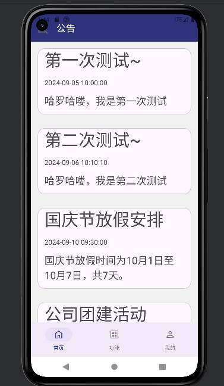
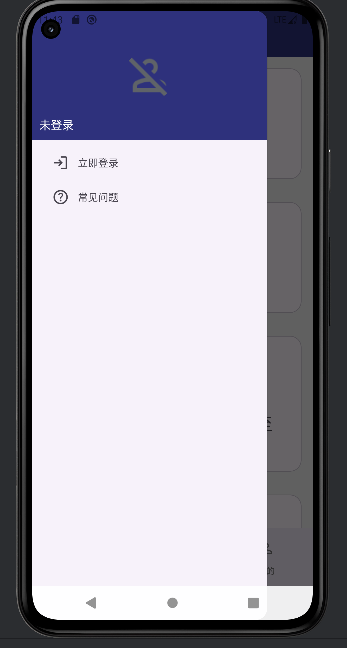
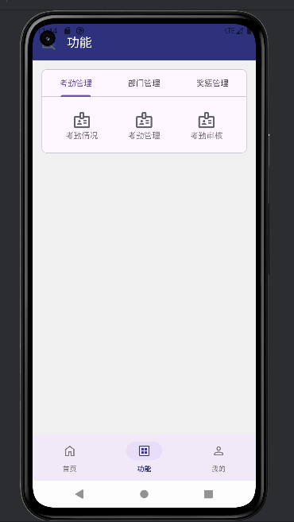
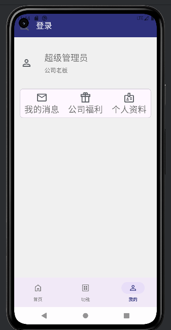
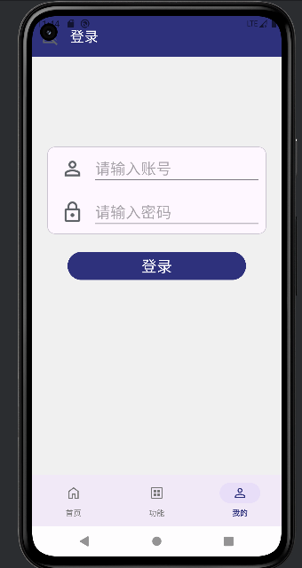
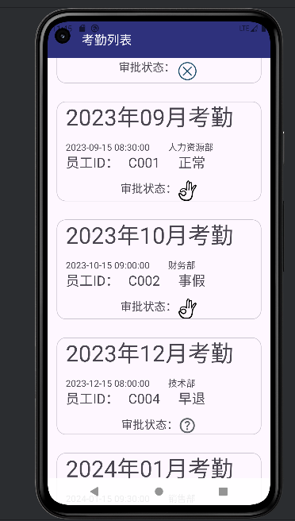
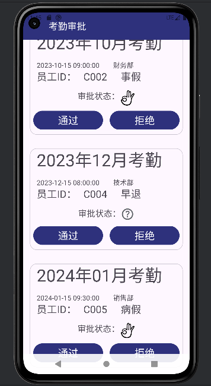

# StuffManagerApp

My practice works

## 目的

练手之作，用来练习使用 retrofit 库、MVVM 架构、recycleview、fragment、lifecycle、协程

## 环境

AGP:8.5.1
Gradle:8.7
Android Studio:Koala|2024.1.1
Android:10.0

## 一览

数据是从 pc 数据库获得

首页

导航栏：显示用户信息

功能界面

个人资料

登录界面

考勤列表

考勤审批

